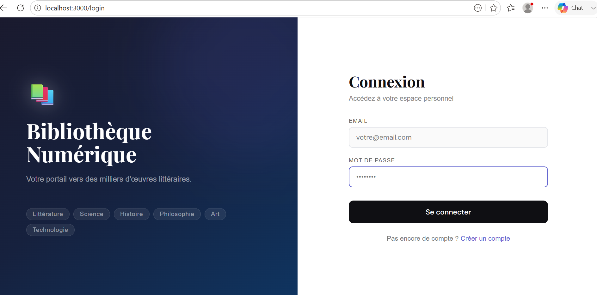
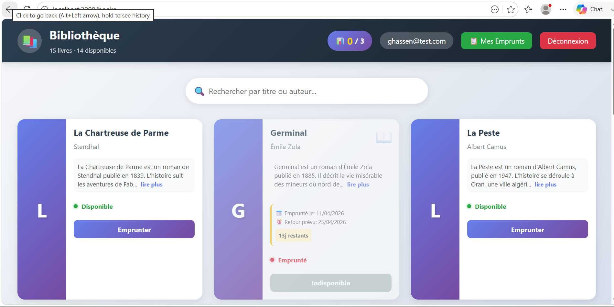
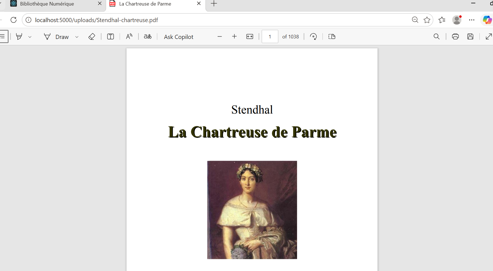
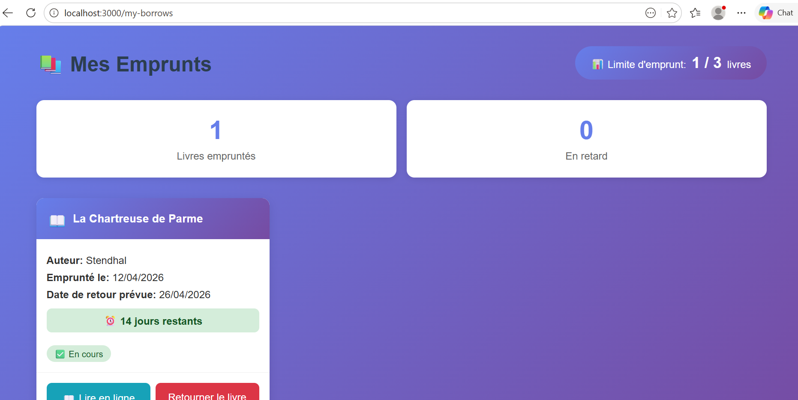

# 📚 Bibliothèque Numérique

Application web complète de gestion de bibliothèque permettant aux utilisateurs d'emprunter et de lire des livres en ligne, avec un panel d'administration complet.

## ✨ Fonctionnalités

### 👤 Utilisateurs
- Inscription et connexion sécurisée
- Consultation du catalogue de livres
- Recherche de livres par titre ou auteur
- Emprunt de livres (limite de 3 livres simultanément)
- Lecture de livres en PDF (format ebook)
- Suivi des emprunts en cours
- Historique des retours

**Aperçu de l'interface utilisateur :**

| Fonctionnalité | Aperçu |
|----------------|--------|
| Connexion |  |
| Catalogue |  |
| Lecture PDF |  |
| Mes emprunts |  |

### 👑 Administrateurs
- Dashboard dédié
- Gestion complète des livres (CRUD)
- Upload de fichiers PDF
- Gestion des utilisateurs (rôles, suppression)
- Consultation de l'historique des emprunts
- Suivi des connexions utilisateurs
- Gestion des livres supprimés (restauration)

## 🛠️ Technologies utilisées

### Backend
- **Node.js** - Runtime JavaScript
- **Express.js** - Framework web
- **MySQL** - Base de données relationnelle
- **JWT** - Authentification sécurisée
- **bcrypt** - Hachage des mots de passe
- **Multer** - Upload de fichiers PDF

### Frontend
- **React.js** - Bibliothèque UI
- **Vite** - Build tool
- **Axios** - Requêtes HTTP
- **React Router DOM** - Navigation
- **CSS3** - Styles modernes et responsive

## 🚀 Installation

### Prérequis
- Node.js (v18 ou supérieur)
- MySQL (v8 ou supérieur)
- Git

### 1. Cloner le projet
```bash
git clone https://github.com/gaith_hammouda/bibliotheque-numerique.git
cd bibliotheque-numerique
#backend
cd backend
npm install
npm start
#frontend
cd frontend
npm install
npm run dev
#Configuration (creer fichier .env)
DB_HOST=localhost
DB_USER=root
DB_PASSWORD=your_password
DB_NAME=bibliotheque
JWT_SECRET=secret_key

---

### 3. 📸 Vérifie les images
Ton README utilise :
```md
screenshots/login.png
## 🌐 Démo
Lien du site : https://github.com/gaithhammouda27-jpg/bibliotheque-numerique.git

## 👨‍💻 Auteur
- Ghaith Hammouda